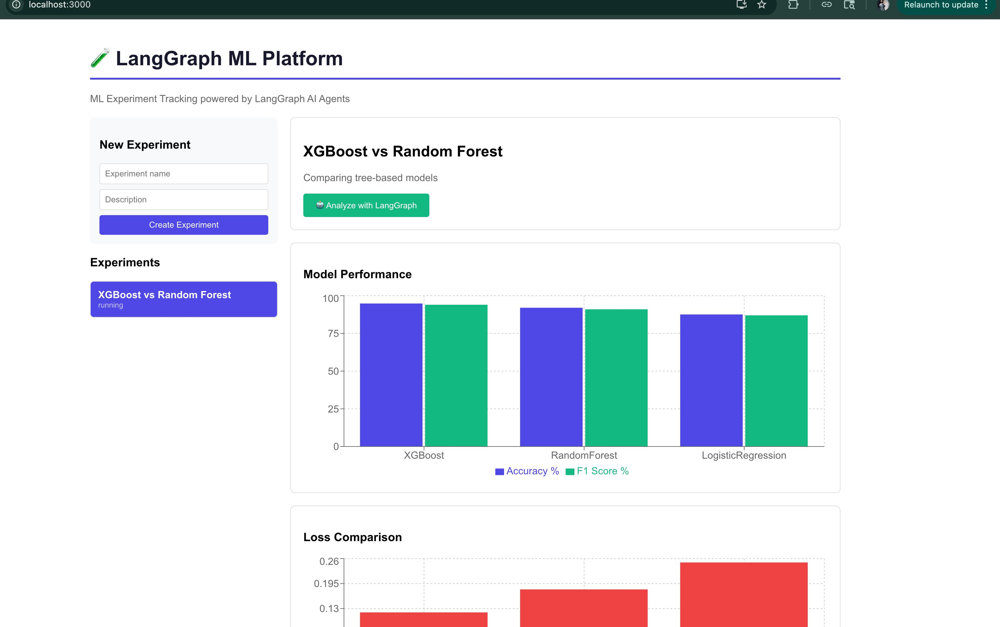

# LangGraph ML Platform

Full-stack ML experiment tracking platform with React dashboard and LangGraph AI agents for automated experiment analysis and recommendations.

## Demo


## Architecture
```
React + TypeScript Frontend
          ↓
    FastAPI Backend
          ↓
   LangGraph Agents (Claude)
          ↓
   SQLite / PostgreSQL
```

## Tech Stack
- **Frontend:** React, TypeScript, Recharts
- **Backend:** Python, FastAPI, SQLAlchemy
- **AI Agents:** LangGraph, Claude API (claude-sonnet-4-5)
- **Database:** SQLite (local), PostgreSQL (production)
- **Infrastructure:** Docker, AWS

## Features
- Create and manage ML experiments
- Log model runs with metrics (accuracy, loss, F1, precision, recall)
- Real-time performance charts and comparisons
- LangGraph AI agent analyzes experiment results
- Automated recommendations for model improvement
- REST API for programmatic access

## Project Structure
```
langraph-ml-platform/
├── backend/
│   ├── src/
│   │   ├── main.py        # FastAPI endpoints
│   │   ├── agents.py      # LangGraph analysis agents
│   │   ├── models.py      # SQLAlchemy models
│   │   ├── schemas.py     # Pydantic schemas
│   │   └── database.py    # DB connection
│   └── tests/
│       └── test_api.py
└── frontend/
    └── src/
        └── App.tsx        # React dashboard
```

## Quick Start

**Backend:**
```bash
cd backend
python3 -m venv venv && source venv/bin/activate
pip install -r requirements.txt
echo "ANTHROPIC_API_KEY=your-key" > .env
python3 src/main.py
```

**Frontend:**
```bash
cd frontend
npm install
npm start
```

## API Endpoints

```bash
# Create experiment
POST /experiments

# Log a run
POST /runs

# Get all runs for experiment
GET /runs?experiment_id={id}

# Trigger LangGraph analysis
POST /experiments/{id}/analyze
```

## LangGraph Agents

Two agents in the pipeline:
1. **Analyze Agent** — compares model metrics, identifies trends
2. **Recommend Agent** — generates 3 actionable improvement steps

## Dataset
Compatible with any ML experiment data. Demo uses XGBoost vs Random Forest vs Logistic Regression comparison.